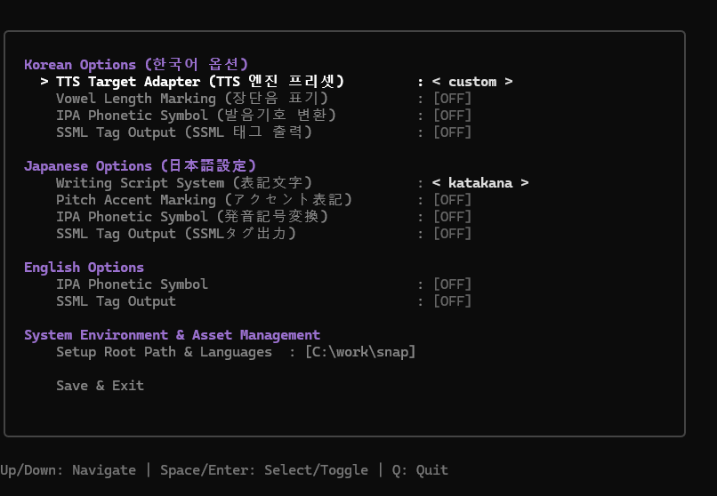

# 🎛️ SNAP TUI Option Configurator (Optional Tool Guide)

> [!NOTE]
> **Optional Tool**: `snap-setup` is an **optional TUI configuration tool** designed for interactive option tuning (e.g. vowel length, pitch accent, IPA mode) and asset downloads. **Standard C++ SDK integration does NOT require running this tool.**

`snap-setup` is an optional interactive Terminal User Interface (TUI) tool designed for the SNAP Multilingual TTS Engine. It provides convenient **per-language option tuning**, **project root (`SNAP_HOME`) configuration**, and **asset status verification**.

---

## 1. Quick Start

Run the prebuilt standalone binary directly from your terminal (CMD, PowerShell, Bash). No Go runtime installation required.

### Windows
```cmd
.\bin\snap-setup.exe
```

### Linux / macOS
```bash
chmod +x ./bin/snap-setup-linux
./bin/snap-setup-linux
```

> **Run from Go Source (For Developers)**
> ```bash
> go run ./setup
> ```

---

## 2. Keybindings

| Key | Description |
| :--- | :--- |
| **`Up` / `Down`** (or `k` / `j`) | Navigate menu items |
| **`Space` / `Enter`** | Toggle options, cycle values, enter sub-menus, execute buttons |
| **`Tab` / `Shift+Tab`** | Move focus in sub-menus (`[1]` ➔ `[2]` ➔ `[3]`) |
| **`Esc`** | Return to main menu |
| **`Q` / `Ctrl+C`** | Quit program immediately from anywhere |

---

## 3. Screen Layout & Feature Guide



### 1) Main Menu
Tune language-specific text normalization and phonological transformation options.

```text
┌────────────────────────────────────────────────────────────────────────┐
│  SNAP Setup                                                            │
│                                                                        │
│  Korean Options (한국어 옵션)                                          │
│    > TTS Target Adapter (TTS 엔진 프리셋)       : < custom >           │
│      Vowel Length Marking (장단음 표기)         : [OFF]                │
│      IPA Phonetic Symbol (발음기호 변환)        : [OFF]                │
│      SSML Tag Output (SSML 태그 출력)           : [OFF]                │
│                                                                        │
│  Japanese Options (日本語設定)                                         │
│      Writing Script System (表記文字)           : < katakana >         │
│      Pitch Accent Marking (アクセント表記)      : [OFF]                │
│      IPA Phonetic Symbol (発音記号変換)         : [OFF]                │
│      SSML Tag Output (SSMLタグ出力)             : [OFF]                │
│                                                                        │
│  English Options                                                       │
│      IPA Phonetic Symbol                        : [OFF]                │
│      SSML Tag Output                            : [OFF]                │
│                                                                        │
│  System Environment & Asset Management                                 │
│      Setup Root Path & Languages                : [C:\work\snap]       │
│                                                                        │
│      Save & Exit                                                       │
└────────────────────────────────────────────────────────────────────────┘
```

#### Korean Options
* **TTS Target Adapter**: Cycles target TTS engine preset between `< custom >` (기본 발음열), `< melotts >` (MeloTTS 호환), `< f5tts >` (F5-TTS 호환), `< ssml >` (W3C SSML 태그), `< raw >` (`[P1]~[P3]` 추상 태그).
* **Vowel Length Marking**: Enables vowel length colon symbol (`:`) when set to `[ON]`.
* **IPA Phonetic Symbol**: Outputs International Phonetic Alphabet (IPA) instead of Hangul when set to `[ON]`.
* **SSML Tag Output**: Wraps phonetic output with SSML break tags when set to `[ON]`.

#### Japanese Options
* **Writing Script System**: Cycles output format between `< katakana >`, `< hiragana >`, and `< romaji >` via `Space`/`Enter`.
* **Pitch Accent Marking**: Includes pitch accent overline/contour markings when set to `[ON]`.
* **IPA Phonetic Symbol**: Outputs Japanese IPA symbols when set to `[ON]`.
* **SSML Tag Output**: Wraps Japanese phonetic output with SSML tags when set to `[ON]`.

#### English Options
* **IPA Phonetic Symbol**: Converts English words to IPA phonetic notation when set to `[ON]`.
* **SSML Tag Output**: Wraps English output with SSML tags when set to `[ON]`.

---

### 2) System Environment & Asset Configuration Menu (`Setup Root Path & Languages`)
Select `Setup Root Path & Languages` from the main menu to open this section.

```text
┌────────────────────────────────────────────────────────────────────────┐
│  System Environment & Asset Configuration                              │
│                                                                        │
│  SNAP_HOME Env Var : Registered (C:\work\snap)                         │
│  Engine Status     : [KO: READY]  [JA: READY]  [EN: MISSING]           │
│                                                                        │
│  > [1] Target Root Path : C:\work\snap                                 │
│                                                                        │
│    [2] Select Languages to Download / Update:                          │
│        [O] KO (Korean)                                                 │
│        [O] JA (Japanese)                                               │
│        [ ] EN (English)                                                │
│        [ ] ALL Languages                                               │
│                                                                        │
│    [3] Update & Install Assets                                         │
│                                                                        │
│    Asset Verification Analysis:                                        │
│      [OK] All required assets for selected language(s) are fully installed.│
└────────────────────────────────────────────────────────────────────────┘
```

#### Header Status Information
* **`SNAP_HOME Env Var`**: Displays OS environment variable status and currently active path.
* **`Engine Status`**: Shows per-language (`KO`, `JA`, `EN`) readiness badges (`READY` / `MISSING`).

#### Controls & Workflow
1. **`[1] Target Root Path`**: Edit target project absolute path directly in the text input box.
2. **`[2] Select Languages to Download / Update`**:
   * Use `Space` / `Enter` to select/deselect target languages (`KO`, `JA`, `EN`, `ALL`) marked with `[O]`.
3. **`[3] Update & Install Assets`**:
   * Downloads and deploys selected model assets from Hugging Face Hub, and **registers `SNAP_HOME` permanently** into your OS registry/shell profile.
4. **`Asset Verification Analysis`**:
   * Automatically verifies asset integrity based on selected languages and provides concise, smart summary reporting.

---

## 4. Saving Configuration (`Save & Exit`)

Selecting `Save & Exit` writes configuration settings directly to **`<SNAP_HOME>/models/ko/model_index.json`**. Both C++ and Python inference engines read this configuration file at initialization.

```json
{
  "version": "1.0.0",
  "languages": {
    "ko": {
      "vowel_length": false,
      "to_ipa": false,
      "tn_only": false
    },
    "ja": {
      "script": "katakana",
      "pitch_accent": false,
      "to_ipa": false,
      "tn_only": false
    },
    "en": {
      "to_ipa": false,
      "tn_only": false
    }
  }
}
```
