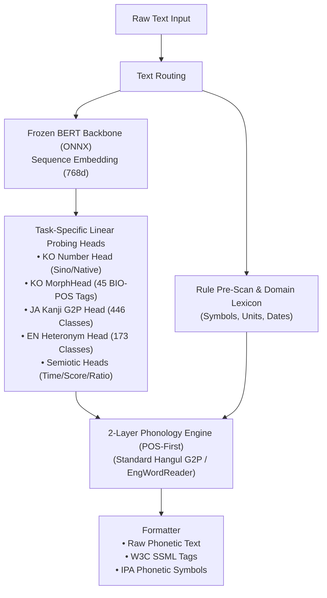

# SNAP (Semantic Normalization via Attached Probes) Technical White Paper

> **Real-Time Context-Aware Multilingual Speech Pre-Processing Engine (TTS Frontend & ITN)**  
> *A Hybrid Architecture Combining Lightweight ONNX BERT Probing Heads with Deterministic Linguistic Rules*

[English](SNAP_White_Paper.md) | [한국어](SNAP_White_Paper_KO.md)  
[Official Website](https://snap-libs.github.io/snap/) | [Text Frontend Demo](https://huggingface.co/spaces/softguy777/snap-demo) | [MeloTTS Demo](https://huggingface.co/spaces/softguy777/snap_voice_demo) | [Piper Demo](https://huggingface.co/spaces/softguy777/snap_voice_demo2) | [F5-TTS Demo](https://huggingface.co/spaces/softguy777/snap_voice_demo3)

---

## 1. Overview: Why SNAP is Essential

### ① Cascading Error Propagation in TTS Pipelines
Text-to-Speech (TTS) systems typically operate as a sequential pipeline: **Text Normalization (TN) → Grapheme-to-Phoneme (G2P) → Acoustic Model → Vocoder**.  
Any misreading or non-standard phonetic conversion occurring in the frontend (TN/G2P) stage propagates directly to downstream acoustic models, which cannot self-correct. Consequently, frontend pre-processing accuracy is the decisive bottleneck for final speech intelligibility and naturalness.

### ② Structural Limitations of Existing Pre-Processing Approaches
* **1. Rule-Based & Finite-State Transducer (FST) Approaches (g2pK, Thrax, espeak-ng)**:
  * Efficient, lightweight, and deterministic for standardized canonical text.
  * However, purely surface-level string pattern matching fails to disambiguate pronunciations dictated by surrounding context or semantic nuances:
    * Korean numeral disambiguation: `"3번 버스"` [sam beon] (route #3) vs `"3번 반복"` [se beon] (3 iterations).
    * Korean time vs ratio: `"3:10에 출발"` [se si sip bun] (3:10 PM) vs `"경기 결과 3:10"` [sam dae sip] (3 to 10).
    * Homographs / Heteronyms: `"소송의 대가(代價)"` [daekka] (cost) vs `"바둑의 대가(大家)"` [daega] (master).
  * Handling contextual edge cases solely with rules requires impossibly complex, brittle conditional branches.
* **2. Neural Seq2Seq / Translation-Based Approaches (RNN, Transformer-TN)**:
  * Generates normalized text or phoneme sequences directly from input text.
  * While capturing broader context, generative models inherently carry risks of **hallucinations, token omissions, and arbitrary substitutions**, which are unacceptable in zero-defect TTS production.
* **3. Large Language Model (LLM) Approaches (Few-Shot / Instruction-Tuned)**:
  * Demonstrates superior semantic comprehension, but imposes **prohibitive compute costs and 200–500+ ms latency**.
  * Impractical for real-time conversational streaming, AICC (AI contact centers), and on-device environments.

> **💡 The Industry Bottleneck: Lack of Full Automation & Manual Verification**  
> Due to these limitations, commercial production environments (audiobooks, broadcast dubbing, AICC) still rely on human reviewers to manually correct phonetic transcripts or inject custom SSML tags. In unscripted, real-time conversational AI (LLM-to-Speech), such manual oversight is impossible, leaving pre-processing distortions fully exposed to end users.

### ③ The SNAP Hybrid Solution
SNAP reconciles these trade-offs through a hybrid paradigm: **"Neural Context Representation + 100% Deterministic Rule Execution"**.

* **Neural Network as Context Provider (Span-Level Probing Heads)**:
  * The neural network does not generate text directly.
  * Instead, a lightweight Probing Head attached to a Frozen BERT Backbone identifies the semantic properties (Span tags, part-of-speech, numeral classification) of ambiguous tokens with minimal compute overhead.
* **Deterministic Rule Engine as Decision Maker**:
  * Using neural semantic tags, the rule and lexicon engine performs exact text replacement and standard phonological transformations (nasalization, tensification, liaison).
  * This completely eliminates hallucinations and allows instant hot-patching via custom dictionary overrides.
* **Standalone Mode**: Low memory footprint (~120MB) and ultra-low latency (<40ms CPU, <15ms GPU) for standard real-time TTS pipelines.
* **Embedded Mode (BERT-Integrated TTS)**: In architectures where the acoustic model already computes BERT embeddings (e.g., MeloTTS, BERT-VITS2), SNAP shares the computed hidden states, reducing frontend compute latency to near-zero (microseconds).

---

## 2. Core Capabilities & Value Proposition

SNAP converts raw input text into authentic phonetic sequences and natural prosodic pause structures, enabling dependable speech synthesis without manual script review.

---

### 1) Standard Korean Phonology & Morpho-Syntactic Disambiguation
* **Full Standard Korean Pronunciation Coverage**:
  * Implements all 30 articles of the National Institute of Korean Language standard pronunciation rules, including nasalization, lateralization, palatalization, aspiration, tensification, liaison, neutral coda mapping, and double coda (`ㄺ/ㄼ`) exceptions.
* **Part-of-Speech Context Disambiguation**:
  * Distinguishes identical surface characters by syntactic function (e.g., connective particle `'과'` [gwa] vs academic noun suffix `'-과'` [-kkwa]).
  * Disambiguates genitive particle `'의'` [e] from root morpheme `'의'` [i] (as in `'의의'`, `'정의'`).
* **Realistic Conversational Loanword Pronunciation**:
  * Reflects actual spoken norms for common loanwords (e.g., `버스` [ppeoseu], `서비스` [sseobiseu], `골` [kkol]) to eliminate auditory stiffness.

---

### 2) Seamless English & Acronym Reading in Multilingual Text
* **Contextual English & Terminology Transliteration**:
  * Automatically maps embedded English terms, IT vocabulary, and brand names into natural Korean phonetic equivalents.
* **Zero-Shot Out-of-Vocabulary (OOV) Compound Transliteration**:
  * Deconstructs and pronounces novel English compounds and acronyms without dictionary lookup  
    *(e.g., `AAAtechnology` [ei-ei-ei-te-keu-nol-lo-ji], `CloudNative` [keul-la-u-deu-nei-ti-beu], `LlamaIndex` [la-ma-in-dek-seu])*.
* **N-Gram Model Number Detection**:
  * Scans surrounding context to pronounce alphanumeric product codes naturally  
    *(e.g., `iPhone 16 Pro` [ai-pon sip-yuk peu-ro], `Galaxy S24+` [gael-leok-si e-seu-i-sip-sa pleo-seu], `PS5` [pa-i-beu], `Windows 10` [ten])*.
* **Inflectional Morphology Handling**:
  * Accurately renders plural (`~s`, `~es`) and adverbial (`~ly`) suffixes into fluent spoken Korean.

---

### 3) Context-Aware Numeral Normalization (Sino-Korean vs. Native Korean)
* **Automatic Numeral System Disambiguation**:
  * Distinguishes Native Korean counters ('hana, dul, set...') from Sino-Korean counters ('il, i, sam...') based on syntactic context.
  * Examples: `"3번 버스"` **[sam beon]** (route #3) vs `"3번 반복"` **[se beon]** (3 times).
  * Examples: `"20대 청년"` **[i-sip-dae]** (20s age group) vs `"차 20대"` **[seu-mu-dae]** (20 vehicles).
* **Comprehensive Counter Lexicon**:
  * Natively maps 50+ Native units (`개, 명, 살, 마리, 잔, 병, 채, 권, 캔, 팩`, etc.) and Sino units (`층, 호, 년, 월, 일, 원, kg, %`, etc.).

---

### 4) Complex Symbols, Formulas, and Formatting
* **Currency & Engineering Units**:
  * `$100` [baek dal-leo], `₩10,000` [man won], `$1.5` [il-jjeom-o dal-leo].
  * 70+ measurement units (`kg, cm, %, GB, Mbps, ℃, kcal`) and Unicode symbols (`㎾h`, `㎎`, `㎞`, `㎖`).
* **Dates, Times, Versions, & Contact Formats**:
  * Dates (`2026.8.23`, `8/17일`), fractions (`3/4` [sa-bun-ui sam]), quarters (`3/4분기` [sam-sa-bun-gi]), software versions (`v1.0.0`, `ver 2.1`), phone numbers & IP addresses (`010-...`, `192.168.1.1`).
* **Mathematical Operators & Symbol Compounds**:
  * Operators (`+`, `-`, `×`, `÷`, `=`), technical keywords (`C++`, `GalaxyS24+`, `C#`, `R&D`, `K-방역`).
* **Decorative Glyph Sanitization**:
  * Strips non-speech decorative symbols (`★`, `※`, `☎`) and parenthetical annotations.

---

### 5) Prosodic Pause Prediction & Sentence Boundary Recovery
* **Automated Breath Pause Insertion (W3C SSML)**:
  * Injects 3-tier prosodic pause tags (`[P1]` 150ms minor break, `[P2]` 300ms clause break, `[P3]` 500ms sentence terminator) or standard W3C SSML `<break>` tags.
  * **Input**: `"정부는 오늘 오전 국무회의를 열고 내년도 예산안 편성 지침을 최종 확정했습니다"`
  * **Output (SSML)**: `<speak>정부는 <break strength="weak"/> 오늘 오전 궁무회이를 열고 <break strength="medium"/> 내년도 예사난 편성 지치믈 최종 확쩡핻씀니다.</speak>`
* **STT Sentence Boundary Restoration**:
  * Reconstructs clause and sentence boundaries from unpunctuated ASR transcripts.

---

## 3. Technical Architecture

SNAP couples neural semantic understanding with deterministic linguistic rules in an end-to-end modular pipeline.

1. **Frozen BERT Backbone & Task-Specific Probing Heads**:
   * A single forward pass through the BERT backbone produces hidden representations (`[seq_len, 768]`) shared across all attached probing heads.
   * Isolates complex classification tasks into micro-heads, maximizing throughput.
2. **Cloud REST API & On-Premise SDK Docker**:
   * Instant cloud deployment via high-concurrency REST API endpoints.
   * Standalone Docker containers and C++ Native SDKs for air-gapped, security-critical enterprise environments.
3. **Massive Golden Regression Verification**:
   * Continuous integration validated against a 10,000-case Golden Baseline to guarantee zero regression on existing phonological rules when adding new domain terms.

---

## 4. Benchmark & Performance

Processing latency is optimized across both standalone and embedded runtime modes to easily satisfy real-time conversational constraints.

---

### 1) Latency by TTS Integration Architecture

| Integration Mode / TTS Target | Mechanism | Added Latency / Sentence | Remarks |
| :--- | :--- | :---: | :--- |
| **BERT-Integrated TTS** *(MeloTTS, BERT-VITS2)* | Shares computed BERT hidden states (Probing Head inference only) | **Near-Zero** *(Microseconds)* | Zero redundant neural compute |
| **Standalone TTS (GPU)** *(F5-TTS, CosyVoice)* | Single forward pass via ONNX BERT Backbone (CUDA / TensorRT) | **11 ~ 14 ms** | Real-time conversational streaming |
| **Standalone TTS (CPU)** *(Piper, StyleTTS2, On-Device)* | Multithreaded ONNX Runtime CPU execution | **30 ~ 44 ms** | Lightweight on-device deployment |

---

### 2) Latency by Sentence Length (Standalone CPU / GPU)

| Sentence Category | Length (Words / Chars) | CPU Latency (Avg) | GPU Latency (Avg) |
| :--- | :---: | :---: | :---: |
| **Short** | $\le$ 10 words *(~30 chars)* | ~25 ms | ~8 ms |
| **Medium** | 20 ~ 30 words *(~80 chars)* | ~40 ms | ~12 ms |
| **Long** | 50+ words *(~150 chars)* | ~65 ms | ~18 ms |

---

### 3) Resource Efficiency
* **Compact Memory Footprint**: Quantized (Int8) ONNX models and lexicons occupy **~120MB RAM**, suitable for edge devices.
* **Lightweight Probing Heads**: Each task-specific linear head occupies **under 2MB**, enabling straightforward multilingual expansion.

---

### 4) High-Concurrency Batch Processing

Batching groups multiple concurrent user requests into a single tensor execution, maximizing hardware utilization.

#### 📊 Sequential vs. Batch Throughput (GPU)

| Execution Mode | Batch Size | Total Latency (Batch) | Average Latency / Sentence |
| :--- | :---: | :---: | :---: |
| **Sequential** | 1 sentence $\times$ 32 | ~380 ms | ~11.8 ms |
| **Batch 4** | 4 sentences concurrent | ~16 ms | ~4.0 ms |
| **Batch 16** | 16 sentences concurrent | ~28 ms | ~1.7 ms |
| **Batch 32** | 32 sentences concurrent | ~42 ms | ~1.3 ms |

---

## 5. Multilingual Scope & Open-Source Korean TTS Ecosystem

### 1) Multilingual (KO / JA / EN) Support Status

All three languages operate with dedicated Probing Heads and rule pipelines, served live via the Cloud REST API:

* **Korean (KO) — Full Production Maturity**:
  * 10,000-case Golden Baseline regression testing verified.
  * Comprehensive 30-article phonology, numeral/unit context parsing, English loanword reader, and automated prosody tagging.
* **Japanese (JA) — Engine Complete & Live Serving**:
  * 446-class Kanji Onyomi/Kunyomi context classifier (`1日`: tsutachi vs. ichinichi / `人気`: ninki vs. hitoke).
  * Katakana Yomi generation, single proper noun lexicon integration, and full IPA conversion.
* **English (EN) — Engine Complete & Live Serving**:
  * 173-class heteronym part-of-speech disambiguation head (`live` [/lɪv/] vs [/laɪv/], `read` [/riːd/] vs [/rɛd/]).
  * CMUdict phonetic transcription, currency/ordinal normalization, and W3C SSML output.

### 2) Korean Voice Synthesis Ecosystem with Open-Source TTS
* **MeloTTS (Shared RoBERTa Backbone)**: Eliminates redundant BERT computation between the frontend and acoustic model, achieving ultra-low latency Korean synthesis.
* **Piper VITS (Lightweight On-Device)**: Replaces `espeak-ng` with SNAP's precise phonology, enabling natural Korean synthesis across 22 voice styles.
* **F5-TTS (Flow Matching Diffusion)**: Combines SNAP G2P with NFD jamo decomposition, powering 16 preset speakers and high-fidelity **Korean Zero-Shot Voice Cloning** from user reference audio.

### 3) Inverse Text Normalization (ITN) Expansion

* **Spoken-to-Written Form Inversion**:
  * Converts spoken transcripts into clean written formats for captions and text archives:
    * **Currency**: `"이만 삼천오백원"` → **`23,500원`** / `"백오십 달러"` → **`$150`**
    * **Dates/Time**: `"이천이십육년 팔월 이십사일"` → **`2026년 8월 24일`** / `"오후 세시 십분"` → **`오후 3:10`**
    * **Units**: `"삼점오 킬로그램"` → **`3.5kg`** / `"이십오 퍼센트"` → **`25%`**
    * **Japanese**: `"にまんさんぜんえん"` → **`23,000円`** / `"ごがついつか"` → **`5月5日`**
